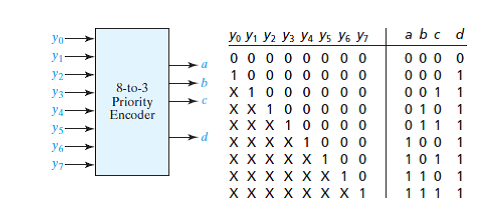

# 8-to-3 Priority Encoder

This module implements an **8-to-3 Priority Encoder** using behavioral modeling in Verilog.

---

## 📁 Files

* `priority_encd.v` → Verilog design
* `priority_encoder_tb.v` → Testbench
* `waveform.png` → Simulation output
* `truth_table.png` → Reference truth table

---

## 📊 Truth Table



---

## 🧠 Description

An 8-to-3 priority encoder converts 8 input lines into a 3-bit binary output.

* Input: `y[7:0]`
* Output: `abc` (encoded value), `d` (valid bit)

👉 If multiple inputs are high, the encoder selects the **highest-priority input**.

### Priority Order:

```
y7 > y6 > y5 > y4 > y3 > y2 > y1 > y0
```

---

## ▶️ Simulation Result

The waveform verifies:

* Correct encoding for single active inputs
* Proper priority selection when multiple inputs are high
* `d = 0` when no input is active

---

## 📌 Example

```
Input  : y = 10101010  
Output : abc = 111  (y7 has highest priority)
         d   = 1
```

---

## 🎯 Learning Outcome

* Understanding of priority encoders
* Use of `casex` for pattern matching
* Handling multiple active inputs
* Writing effective testbenches for validation

---
