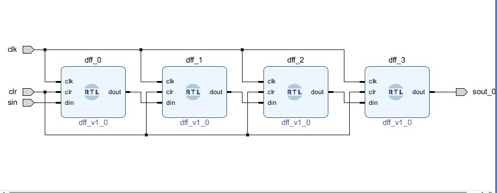

# 4-bit Shift Register (Block Design)

This design implements a 4-bit shift register using Xilinx Vivado IP Integrator (Block Design).

---

## 🧠 Description

The shift register stores and shifts data sequentially with each clock pulse.

This implementation is created using schematic-based design instead of Verilog HDL.

---

## 🧩 Block Diagram

---

## ▶️ Working

* Data is shifted one bit position on each clock cycle
* Supports serial input and parallel output

---

## 🎯 Learning Outcome

* Understanding Vivado IP Integrator
* Designing circuits using block diagrams
* FPGA design workflow

---
